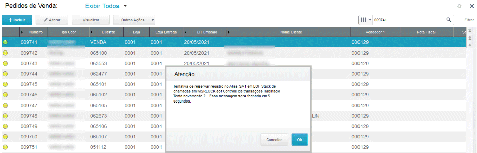

Olá pessoal, bem vindos ao nosso primeiro post.

Esta semana 2 clientes nos procuraram com uma reclamação semelhante: ao tentar excluir um pedido de venda o sistema apresentava a seguinte tela:

Verificamos que o erro era causado por estar cadastrado no pedido um cliente/loja que não fazia parte do cadastro de clientes.
Para resolver o problema específico utilizamos o famoso "Martelo do Thor" e alteramos nas tabelas do pedido de venda (SC5 e SC6) os campos do código e da loja para um cliente que existia. 
Mas para resolver a causa raiz identificamos que no preenchimento dos campos C5_CLIENTE e C5_LOJACLI **NÃO** existe uma validação própria do Protheus que confirme que o cliente digitado existe. O usuário pode até utilizar a tecla F3 para pesquisar o cliente, mas se ele alterar o código ou a loja preenchidos o sistema vai aceitar.
Então sugerimos as seguintes validações a serem acrescentadas no dicionário de dados do pedido de venda:

Campo SX3  | Validação de Usuário
---------  | --------------------
C5_CLIENTE | EXISTCPO(IIF(M->C5_TIPO $ "DB","SA2","SA1"),M->C5_CLIENTE)
C5_LOJACLI | EXISTCPO(IIF(M->C5_TIPO $ "DB","SA2","SA1"),M->C5_CLIENTE+M->C5_LOJACLI)

É isto: problema resolvido.